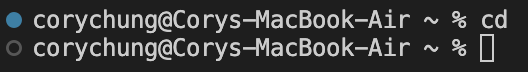
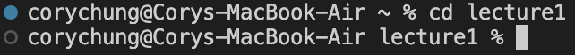
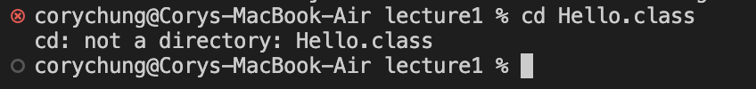
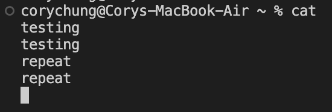
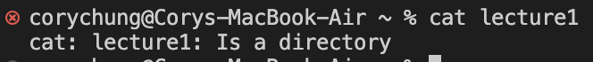
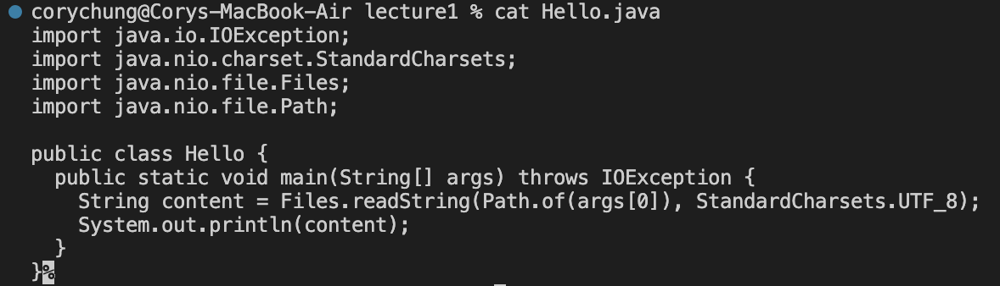

# Lab Report 1 - Cory Chung (A17365955)

## For the command `cd`:

**1. With no arguments:**
   

Absolute path: ~/ (home directory)

This command with no outputs returns the working directory to the home directory. Since I was already in the home directory, it stays in the same place. This is not an error because it is an intended behavior.

**2. With directory argument:**

Absolute path: ~/ (home directory)

This command moves the working directory to the specified directory in the argument as shown in the screenshot. This is NOT an error.

**3. With file argument:**

Absolute path: ~/lecture1

This command moves the working directory to the specified argument. However this is an ERROR because the argument points to a file and not a directory, which is why an error is shown in red.
  
## For the command `ls`:

**1. With no arguments:**
   

Absolute path: ~/ (home directory)

This command lists all the items in the working directory, in this case home or ~/. NOT an error.

**2. With directory argument:**

Absolute path: ~/ (home directory)

This command lists all the items in the specified argument directory, in this case lecture1. NOT an error.

**3. With file argument:**

Absolute path: ~/lecture1

This command simply repeats back the name of the item and filetype. In this example I used Hello.java as the argument which it repeated back to me. This is NOT an error but intended behavior.

## For the command `cat`:

**1. With no arguments:**
   

Absolute path: ~/ (home directory)

This command results in the next words being entered repeating back to itself. For example I typed "testing" and pressed enter and it repeated "testing" back to me, as well as "repeat". This is an ERROR because this does not seem like intended behavior. It also does not seem to be cancellable or able to exit out of.

**2. With directory argument:**

Absolute path: ~/ (home directory)

This command throws an error saying that the specified argument (lecture1) is a directory. This is an ERROR because the cat command only parses files such as .txt but not directories.

**3. With file argument:**

Absolute path: ~/lecture1

This command prints out the contents of the specified argument file, in this case Hello.java. NOT an error.  
