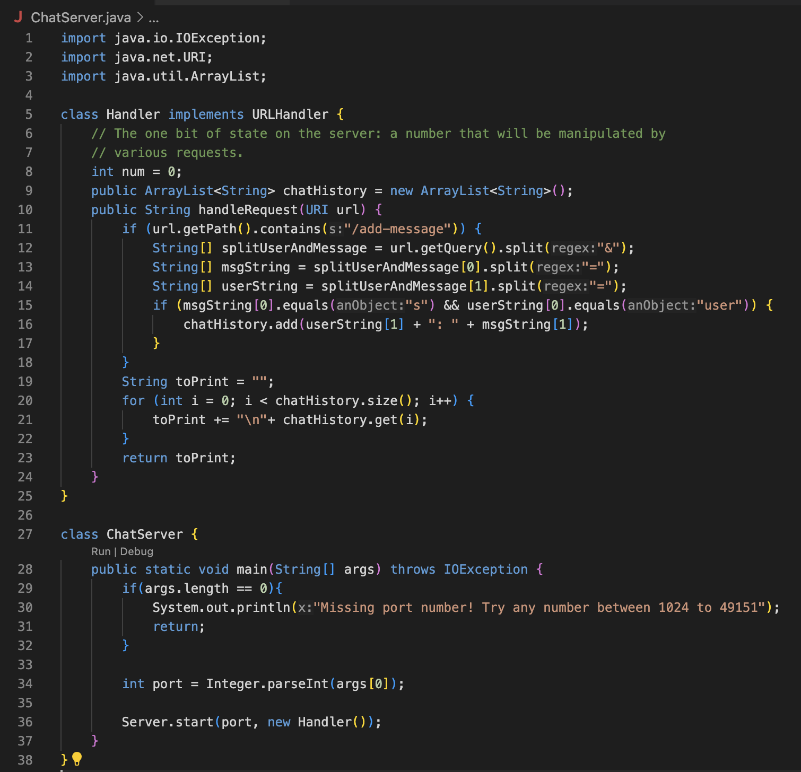
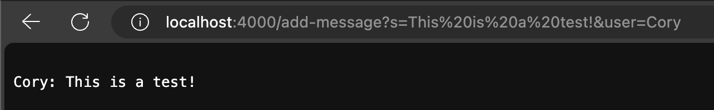
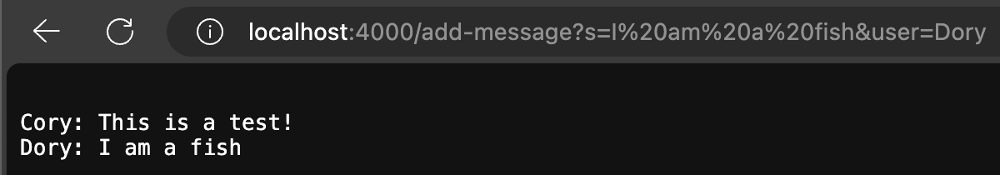
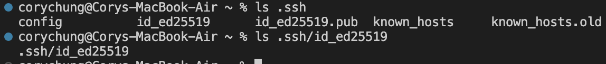
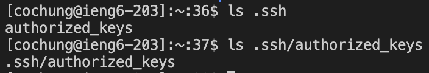
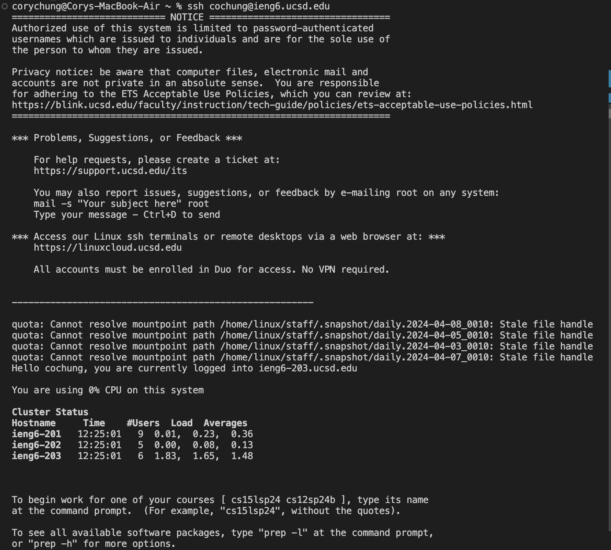

# CSE 15L Lab Report #2 - Cory Chung

## Part 1:

**ChatServer.java**

**Screenshot 1**

***Which methods in your code are called? What are the relevant arguments to those methods, and the values of any relevant fields of the class? How do the values of any relevant fields of the class change from this specific request? If no values got changed, explain why.***

The method that is immediately called in the code is `handleRequest`. This runs the if statement which checks for `/add-message` which, if true, triggers the splitting process. First the `url.getQuery` is split into two separate parameters separated by `&`, which would put the `splitUserAndMessage` String array into two items, with the first item in the Array being `s=This is a test!` and `user=Cory`. Then these two items are further split into `msgString` and `userString` by removing everything before the `=` symbol. Thus `msgString` becomes `This is a test!` and `userString` becomes `Cory`.

Finally, these two strings are added to a previously declared array list called `chatHistory` which logs every past and current chat message. the `toPrint` string converts `chatHistory` into a legible preview and then returns it for the webpage to print out. So here, `chatHistory` and `toPrint` would show the same message, `Cory: This is a test!`, since there is only one message in the "history".

**Screenshot 2**

***Which methods in your code are called? What are the relevant arguments to those methods, and the values of any relevant fields of the class? How do the values of any relevant fields of the class change from this specific request? If no values got changed, explain why.***

Going off of the previous message, the code would trigger `handleRequest` and then create `splitUserAndMessage` which splits the `getQuery()` method into two items, `s=I am a fish` and `user=Dory`. Then `msgString` and `userString` contain `"I am a fish"` and `"Dory"` respectively after splitting once again. Then this message would be added to `chatHistory`, which now contains two items, this one and the previous message from Screenshot 1.

Finally, these message are added to `toPrint` by iterating over `chatHistory` and then returned. The contents of `toPrint` match what is shown in Screenshot 2 above.

## Part 2:
1. ***On the command line of your computer, run ls with the absolute path to the private key for your SSH key for logging into ieng6.***
 
   

2. ***On the command line of the ieng6 machine, run ls with the absolute path to the public key for your SSH key for logging into ieng6 (this is the one you copied to your account on ieng6 using ssh-copy-id, so it should be a path on ieng6's file system).***
 
   

3. ***A terminal interaction where you log into your ieng6 account without being asked for a password.
   ***
   

## Part 3:

***In 2-3 sentences, describe something you learned from lab in week 2 or 3 that you didn't know before.***

Something new I learned from week 2 and 3 was how to properly use `ssh`. I had used it before in personal projects to connect to remote Raspberry Pi servers but didn't know how to use things like public and private key generation to bypass password entry. I think knowing this will be very useful for my future projects as well.

