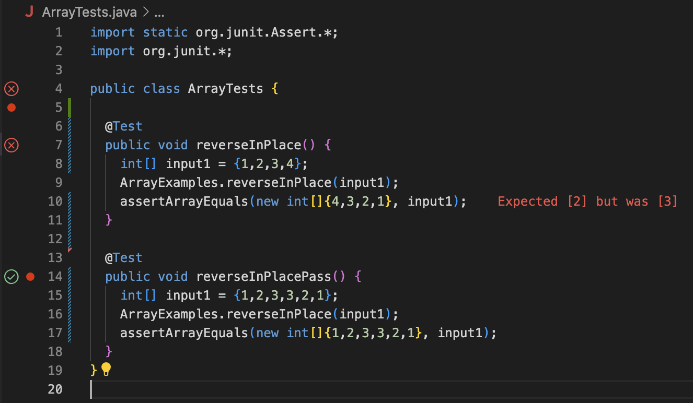
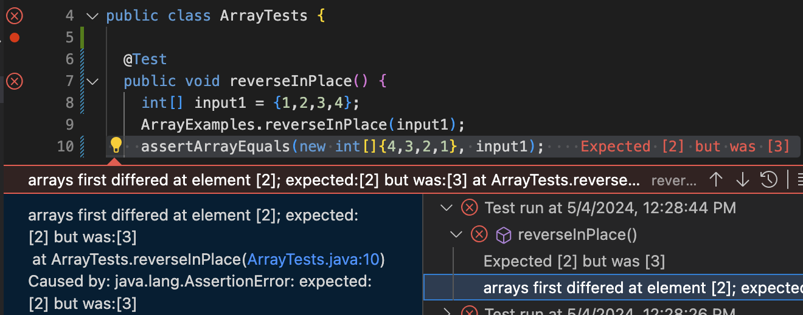
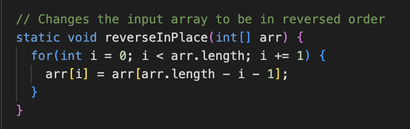
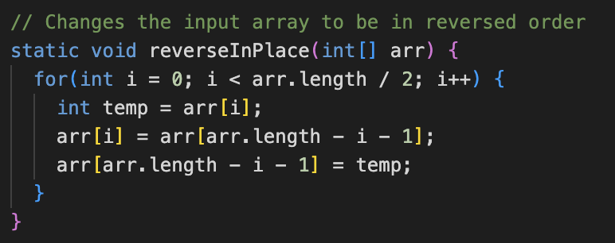

# CSE 15L Lab Report #3 - Cory Chung

## Part 1: Bugs

**1. A failure-inducing input for the buggy program, as a JUnit test and any associated code (write it as a code block in Markdown).**

- The bug that we will be focusing on in this question is the reverseInPlace method. When using the input as seen in the code below, the resulting error is that the third element of the array is assumed to be 2 but is actually 3.
```
@Test
  public void reverseInPlaceFail() {
    int[] input1 = {1,2,3,4};
    ArrayExamples.reverseInPlace(input1);
    assertArrayEquals(new int[]{4,3,2,1}, input1);
  }
```

**2. An input that doesn't induce a failure, as a JUnit test and any associated code (write it as a code block in Markdown).**

- The following doesn't induce a failure:
```
@Test
  public void reverseInPlacePass() {
    int[] input1 = {1,2,3,3,2,1};
    ArrayExamples.reverseInPlace(input1);
    assertArrayEquals(new int[]{1,2,3,3,2,1}, input1);
  }
```

**3. The symptom, as the output of running the two tests above (provide it as a screenshot -- one test should pass, one test should fail).**

- Both tests:

- The fail reason:



**4. The bug, as the before-and-after code change required to fix it (as two code blocks in Markdown).**

- Before:

- After:



**5. Briefly describe (2-3 sentences) why the fix addresses the issue.**

- In the old code, the issue occurred where the reversing procedure failed at the midpoint because it had already overwritten the array using the values in the beginning half of the array. In the new code, this issue is fixed by having a temporary value that allows the beginning value and the ending value to swap at the same time. So instead of overwriting previous values and having no way to retrieve them in the second half of the reversal, it swaps both values at the same time and thus only needs to iterate through half of the array.

## Part 2: Researching Commands 

### Here I chose the `find` command: ###
### Option 1: `-mtime (n)` ###
Source(s):  
https://ss64.com/bash/find.html  
https://www.computerhope.com/unix/ufind.htm  
https://www.redhat.com/sysadmin/linux-find-command

```
corychung@Corys-MacBook-Air  docsearch % find technical -name "chapter-2.txt" -mtime -4
technical/911report/chapter-2.txt
```
This block finds all text files within `technical` that were modified in the last four days. The negative denotes a search for files modified less than 4 days ago, and a `+4` value would search for files modified over 4 days ago. No sign would search for modification just within that day time frame. This is useful if you want to find a value that you modified recently but can't remember the name or location.
```
corychung@Corys-MacBook-Air docsearch % find technical -name "chapter-2.txt" -mtime 4
corychung@Corys-MacBook-Air docsearch % find technical -name "chapter-2.txt" -mtime 3 
\technical/911report/chapter-2.txt
```
As stated earlier, `mtime (n)` using no sign in the number simply searches for that file within the timeframe of `n` days ago. So since `chapter-2.txt` was modified within the time frame of 3 days ago (i.e. within those 24 hours) then it is returned using `-mtime 3` but not `-mtime 4`. This is useful for finding files you modified in an exact day but not before or after.
### Option 2: `-delete` ###
Source(s):  
https://ss64.com/bash/find.html  
```
corychung@Corys-MacBook-Air docsearch % find technical -name "chapter-2.txt" -delete
corychung@Corys-MacBook-Air docsearch % ```
```
This block simply finds the specified file and deletes it, returning nothing. Useful when you want to get rid of a lot of files at once but don't know where they are, especially when combined with other arguments.
```
corychung@Corys-MacBook-Air docsearch % find technical -name "doesnt-exist.txt" -delete
corychung@Corys-MacBook-Air docsearch %
```
This block does the same but demonstrates the flaw in this argument. Even if nothing is found to match the find command there is no message indicating that something was deleted or not. So one should be careful and check afterwards if files were deleted or not.
### Option 3: `empty` ###
Source(s):  
https://ss64.com/bash/find.html  
```
corychung@Corys-MacBook-Air docsearch % find technical -empty 
technical/911report/findme
```
This block demonstrates `empty` which searches within a directory if it is empty or not. I created a dummy directory called `findme` which was empty, and this command found it. Useful for trimming useless directories.
```
corychung@Corys-MacBook-Air docsearch % find * -empty
technical/911report/empty.txt
technical/911report/findme
```
Similarly, this also searches for empty files such as `.txt` files. I created a dummy `.txt` file with no content and it was able to find the file and the aforementiond `findme` directory. Again, useful for finding unnecessary files.
### Option 4: `-size` ###
Source(s):  
https://ss64.com/bash/find.html  
```
corychung@Corys-MacBook-Air docsearch % find technical -type f -size -1k  
technical/plos/pmed.0020191.txt
technical/plos/pmed.0020226.txt
```
This block finds all files in `technical` less than 1 kilobyte in size. This is extremely useful for finding files of a specific size type.
```
corychung@Corys-MacBook-Air docsearch % find technical -size +290000c
technical/government/Gen_Account_Office/Statements_Feb28-1997_volume.txt
technical/government/Gen_Account_Office/d01591sp.txt
technical/911report/chapter-13.5.txt
```
This block finds all files greater than 290,000 bytes (or 290 kb). The numbering and rounding conventions follow the same as the `mtime` option so we can use plus or minus to designate greater or less than.