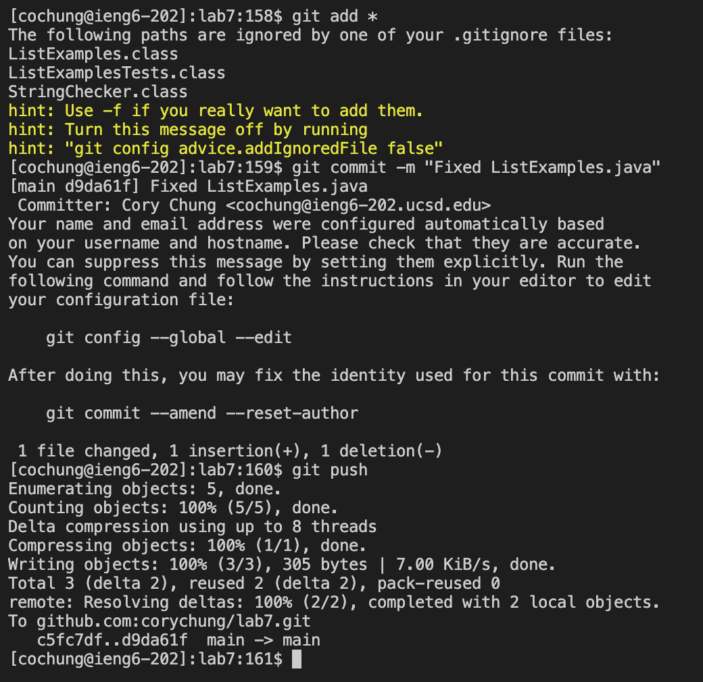

# CSE 15L Lab Report #4 - Cory Chung

## Log into ieng6.

Keys pressed: `ssh<space>cochung@ieng6.ucsd.edu<enter>`

I started at the terminal line. This allows me to enter the ieng6 server and into my working directory inside that server.

## Clone your fork of the repository from your Github account (using the SSH URL).

Here I had the text `git@github.com:corychung/lab7.git` on my clipboard so I could paste it in. I used the keystrokes `git<space>clone<space><CMD+V><enter>`. This clones the repository from my Github to the home directory of my ieng6 server. 

## Run the tests, demonstrating that they fail.

Keys pressed: `cd<space>l<tab><enter>bash<space>t<tab><enter>`.

Here I used tab a few times to autocomplete since there were no other available options in those respective directories. This just entered the directory I just cloned and then ran the `test.sh` file (the only file with "t" in the start so it was able to autocomplete).

## Edit the code file to fix the failing test.

Keys pressed: `vim<space>L<tab>.<enter>:44<enter>er2<ESC>:wq<enter>`

I type `vim` and again use autocomplete to find `ListExamples` then `ListExamples.java`. Then I enter vim mode, use `:44` to find the correct line, `e` to go to the end of the first word which is `index1`, then use `r` to enter replace mode and type `2` to replace `1` with `2`. Then `<ESC>` exits insert mode and `:wq<enter>` saves and exits the file.

## Run the tests, demonstrating that they now succeed.

Keys pressed: `<up><up><enter>`

I simply went back up in bash history to find `bash test.sh` from the previous steps and ran it again. This time it succeeded.

## Commit and push the resulting change to your Github account (you can pick any commit message!).

Keys pressed: `git<space>add<space>*<enter>git<space>commit<space>-m<space>"Fixed<space>ListExamples.java"<enter>git<space>push<enter>`

This is just the process to add commit and push changes as mentioned in previous labs. `add` adds it to the staging area, `commit` commits the changes, then `push` pushes it onto Github.