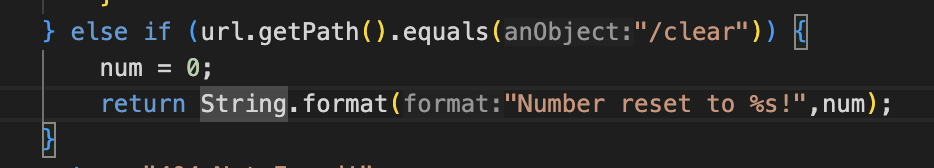

# CSE 15L Lab Report #5 - Cory Chung

## Part 1 – Debugging Scenario

### Student John: 

Hi, I am a little confused on this bug for my NumberServer.java program. I have screenshots of my code, bash, server start, and symptoms below. For some reason, when I use the `/clear` command in curl, it doesn't want to clear the num variable. I think this might be due to something related to the handleRequest method? But I am not sure.

Code:

Bash File:

Terminal for server start:

Here is the symptom. For some reason, using `/clear` doesn't want to reset the number to 0.

### TA Allen: 

Have you tried double checking to make sure you are manipulating the correct variables?

### Student John: 

After double checking my code, I found the problem. In the `/clear` code block I put `int num = 0` instead of `num = 0`. This created an entirely new local variable also called `num` which was always set to `0`, but never affected the outside variable which was also called `num`. So I removed the `int` keyword and it is working now fully.

Initial:

Corrected:

Working:

### Setup Information

**The file & directory structure needed**

  - For the file and directory structure, we need `NumberServer.java`, `Server.java`, and `test.sh` all in the same folder. 

**The contents of each file before fixing the bug**

  - NumberServer.java: *see initial Student John post*

  - Server.java: 

  - test.sh: *see initial Student John post*

**The full command line (or lines) you ran to trigger the bug**

  - In terminal: *see initial Student John post*

**A description of what to edit to fix the bug**

  - How to fix: remove `int` keyword from line 21.

## Part 2 – Reflection
**In a couple of sentences, describe something you learned from your lab experience in the second half of this quarter that you didn't know before. It could be a technical topic we addressed specifically, something cool you found out on your own building on labs, something you learned from a tutor or classmate, and so on. It doesn't have to be specifically related to a lab writeup, we just want to hear about cool things you learned!**

One thing I learned from my lab experience that I didn't know before was mainly about how much power bash can provide. I knew that bash was used to compile things and create new files and directories. However I didn't know that it was possible to use bash in scripting files and even create things like "for" and "if" loops. I feel like this is valuable because it opens up a lot more possibilities when it comes to using the computer itself. It's one thing to know how to write code but another thing entirely to learn how to organize that code on a computer and deploy it in an efficient manner, and with bash scripting I think it becomes a lot easier.

